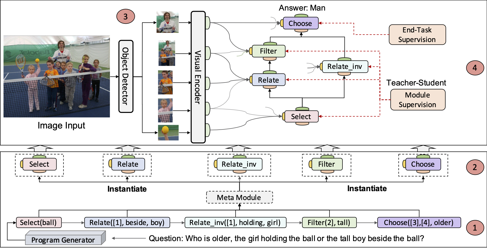

# Meta-Module-Network
Code for WACV 2021 Paper "Meta Module Network for Compositional Visual Reasoning"
<p>

</p>

## Data Downloading
Download all the question files and scene graph files and bottom-up features from the web server, it can take up to 300G disk space.
  ```
    bash get_data.sh
  ```
This script will download questions/ folder, and the "trainval_all_programs.json" is used for bootstrapping and "trainval_unbiased_programs.json" is used for finetunning in the paper. The "trainval_unbiased_programs.json" and "testdev_pred_programs.json" are both generated by the program generator model.

## Meta Module Network Implementation
To understand more detailed implementation of MMN, please refer to [README](https://github.com/wenhuchen/Meta-Module-Network/blob/master/FUNCTION.md).

## Description of different files
- sceneGraphs/trainval_bounding_box.json: the scene graph provided by the original GQA dataset
  ```
    {
      imageId:
      {
        bouding_box_id:
        {
          x: number,
          y: number,
          w: number,
          h: number,
          relations: [{object: "bounding_box_id", name: "relation_name"} ... ],
          name: object_class,
          attributes: [attr1, attr2, ... ]
        },
        bouding_box_id:
        {
          ...
        },
      }
    }
  ```
- questions: the questions-program pairs and their associated images.
  ```
  [
    [
      "ImageId",
      "Question",
      "Programs": [f1, f2, ..., fn],
      "QuestionId",
      "Answer"
    ]
  ]
  ```

## Data Preprocessing [Optional]:
If you want to know how the programs and training data are generated, please follow the following steps:

Download the questions from the original [GQA website](https://nlp.stanford.edu/data/gqa/questions1.2.zip) and then put it in the parent folder '../gqa-questions/', the following steps are aimed to convert "questions" into program format as follows:
1. preprocess the trainval_all_question into trainval_all_programs.json
  ```
    python preprocess.py trainval_all
  ```
2. preprocess the "balanced" programs into different forms:
  ```
    python preprocess.py create_balanced_programs
  ```
  
3. create the programs into the "input" forms for trainval_all_programs.json:
  ```
    python preprocess.py create_all_inputs
  ```

4. create the programs into the "input" forms for *balanced.json:
  ```
    python preprocess.py create_inputs
  ```

5. Preprocess "programs" into pair formats as follows:
  ```
    python generate_program.py --do_preprocess
  ```

## NL2Program Model [Optional]:

- Train the sequence-2-sequence model:
  ```
    python generate_program.py --do_preprocess
  ```

- Evaluate the NL2Program
  ```
    python generate_program.py --do_testdev
  ```
  
- Prepare the generated programs for the modular transformer
  ```
    python generate_program.py --do_trainval_unbiased
  ```

## Meta Module Network Training and Evaluation
- Prepare the inputs for the modular transformer:
  ```
    python preprocess.py create_pred_inputs
  ```
- Start the bootstrap training of the modular transoformer
  ```
   python run_experiments.py --do_train_all --model TreeSparsePostv2 --id TreeSparsePost2Full --stacking 2 --batch_size 1024
  ```
- Start the finetunning on the balanced split
  ```
    python run_experiments.py --do_finetune --id FinetuneTreeSparseStack2RemovalFullValSeed6999 --model TreeSparsePostv2 --load_from models/TreeSparsePost2Full --seed 6999 --stacking 2
  ```
- Test the model on the testdev split
  ```
    python run_experiments.py --do_testdev_pred --id FinetuneTreeSparseStack2RemovalValSeed6777 --load_from [MODEL_NAME]  --model TreeSparsePostv2 --stacking 2
  ```

## Citation
If you find this paper useful, please add the following reference to your paper.
```
  @article{chen2019meta,
  title={Meta module network for compositional visual reasoning},
  author={Chen, Wenhu and Gan, Zhe and Li, Linjie and Cheng, Yu and Wang, William and Liu, Jingjing},
  journal={Proceedings of WACV},
  year={2021}
}
```
